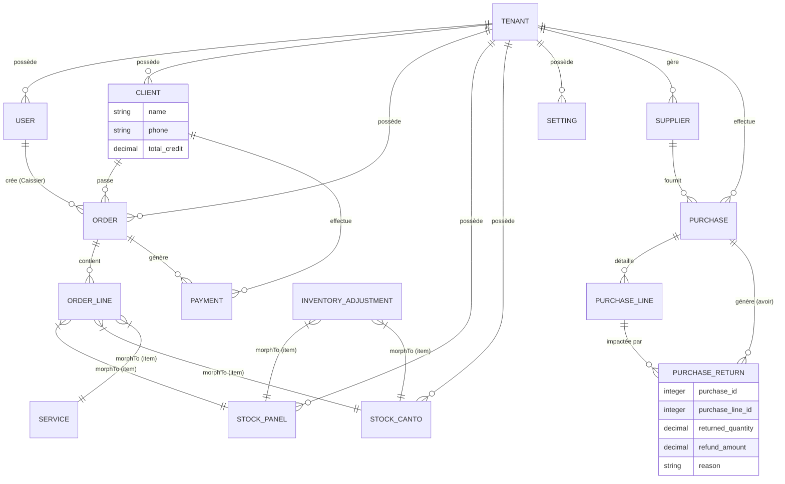

# DEEP_ARCHITECTURE.md - Documentation Technique Architecturale

## 1. Schéma de Base de Données & ERD (Mermaid)

Le système repose sur une structure multi-tenant où chaque atelier de menuiserie possède ses propres données isolées par `tenant_id`.



## 2. Design Patterns & Scopes

### A. Multi-Tenancy (Isolation des Données)
L'isolation est gérée globalement via un **Global Scope** (`TenantScope`) et un **Trait** (`BelongsToTenant`). Cela garantit qu'un utilisateur ne peut jamais voir les commandes ou les clients d'un autre atelier, même par erreur de requête.

### B. Pessimistic Locking (Sécurité Transactionnelle)
Pour éviter les "Race Conditions" lors des ventes flash ou des mises à jour de stock simultanées, le système utilise `lockForUpdate()`. 
*   **Ventes** : Verrouillage du produit et du client pendant le checkout.
*   **Achats** : Verrouillage du solde fournisseur lors de l'enregistrement d'une facture.

### C. Sécurité & Hardening (Patch de Production)
*   **Protection XSS & Data Leak** : L'objet global `window.authUser` est désormais filtré via `json_encode` pour ne renvoyer que les champs `id`, `name`, `role`, et `tenant_id`.
*   **Rate Limiting** : 
    *   Auth : `throttle:5,1` (limite les attaques par brute force).
    *   API : `throttle:60,1` (limite les abus de requêtes).

## 3. Snippets de Code Critiques (Backend)

### Sécurisation du Global User Object (`app.blade.php`)
```html
<script>
    window.authUser = @json(auth()->check() ? auth()->user()->only(['id','name','role','tenant_id']) : null);
</script>
```

### Logique d'Avoir Fournisseur (`PurchaseController@processReturn`)
Lorsqu'un article est retourné au fournisseur, le système déduit automatiquement le montant de la dette du fournisseur et réajuste le stock en une seule transaction atomique.

```php
public function processReturn(Request $request, $id) {
    return DB::transaction(function() use ($request, $id) {
        $purchase = Purchase::findOrFail($id);
        $return = PurchaseReturn::create([
            'purchase_id' => $purchase->id,
            'purchase_line_id' => $request->line_id,
            'returned_quantity' => $request->quantity,
            'refund_amount' => $request->refund_amount,
        ]);
        
        $purchase->supplier->decrement('total_debt', $request->refund_amount);
        // ... Logique de décrémentation du stock physique
        return response()->json(['success' => true]);
    });
}
```

## 4. Architecture Frontend (Vue 3)

### Gestion des Icônes (Lucide-Vue-Next)
Pour éviter les erreurs de résolution au runtime, tous les composants utilisent désormais des **imports explicites** pour chaque icône.
Exemple dans `StockMdfPage.vue` :
```javascript
import { 
  PaletteIcon, PackageIcon, AlertTriangleIcon, Edit3Icon, Trash2Icon 
} from 'lucide-vue-next';
```

### Stock Adjustment (Kosor)
Le système gère les pertes matérielles (Casse/Kosor) via une modal dédiée qui enregistre un `InventoryAdjustment`. Cela permet de garder un historique précis des pertes indépendant des ventes.

## 5. Tests & Console Scope

### Stratégie de Test (Factories & Feature Tests)
Le projet utilise une approche de test automatisé basée sur les **Factories** pour générer des données de test cohérentes.
*   **OrderCreationTest** : Vérifie l'intégralité du processus de checkout (API -> DB -> Stock -> Events).
*   **Database Refresh** : Les tests utilisent le trait `RefreshDatabase` pour garantir un environnement propre à chaque exécution.

### TenantScope en mode CLI
Le `TenantScope` a été optimisé pour les commandes Artisan et les tâches Cron.
*   Si l'application tourne en console, le scope est ignoré par défaut (permettant aux jobs de traiter tous les tenants).
*   Il est possible de forcer un contexte spécifique en bindant `current_tenant_id` dans le container Laravel.

---
**Document rédigé par :** Lead Software Architect
**Dernière Mise à Jour :** 02 Mai 2026
**État du Projet :** Production-Ready (Hardened & Tested)
